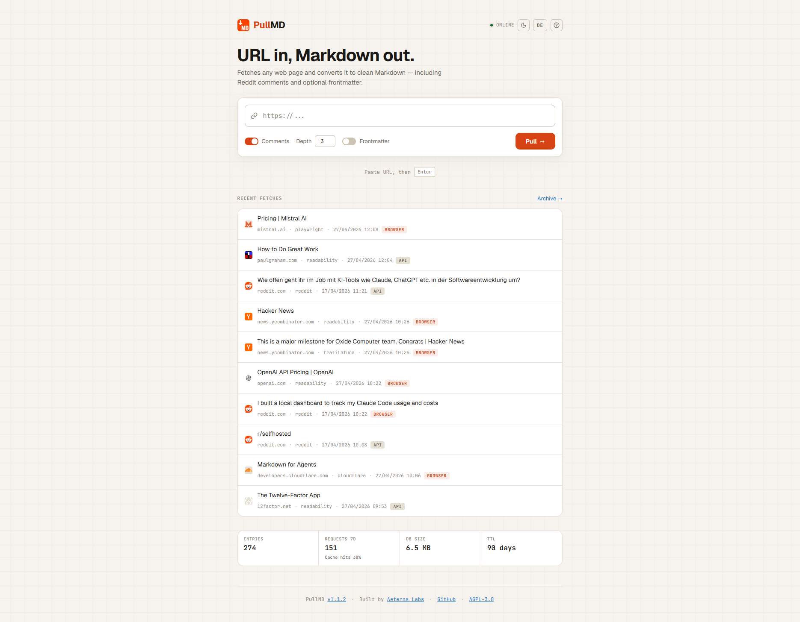

# PullMD

[](https://github.com/AeternaLabsHQ/pullmd/releases)
[](https://hub.docker.com/r/aeternalabshq/pullmd)
[](https://github.com/AeternaLabsHQ/pullmd/actions/workflows/docker.yml)
[](https://github.com/AeternaLabsHQ/pullmd/blob/main/LICENSE)
[](https://github.com/AeternaLabsHQ/pullmd#mcp-server)

Self-hosted URL-to-Markdown service for humans and AI agents.

<p align="center">
  
</p>

PullMD takes any web URL and returns clean, readable Markdown — no
navigation, no ads, no boilerplate. It auto-detects Reddit threads
(with full comment trees), uses Cloudflare's native Markdown when
available, runs Mozilla Readability + Trafilatura on static HTML,
and as a last resort renders JavaScript-heavy pages via headless
Chromium (Playwright sidecar) before extracting.

It ships as:

- a **PWA frontend** with raw/rendered view toggle, dark/paper themes, history, archive, share links, and conversion of local HTML files (drag-and-drop on desktop, file picker on desktop and mobile)
- a **REST API** at `GET /api?url=…`
- an **MCP server** at `POST /mcp` (Streamable-HTTP transport, stateless)
- a **Claude Code skill** as a downloadable zip

Every conversion gets an 8-hex **share id** that works as a stable
live-endpoint: `GET /s/:id` returns the cached markdown and
re-fetches from the source if older than one hour. Use the share id
as a fixed URL that always returns fresh content — useful for
subreddit feeds and similar.

---

## Quick start

Pre-built multi-arch images (`linux/amd64`, `linux/arm64`) live on Docker
Hub. Drop the compose file somewhere and run:

```bash
mkdir pullmd && cd pullmd
curl -O https://raw.githubusercontent.com/AeternaLabsHQ/pullmd/main/docker-compose.yml
docker compose up -d
# → http://localhost:3000
```

That's it. No `.env` needed: every variable has a sensible default
and PullMD listens on port `3000`. Add a `.env` next to the compose
file to override anything (see [Configuration](#configuration)).

### `docker-compose.yml` (zero-config)

```yaml
services:
  pullmd:
    image: aeternalabshq/pullmd:latest
    container_name: pullmd
    restart: unless-stopped
    ports:
      - "${PORT:-3000}:3000"
    environment:
      - PUBLIC_URL=${PUBLIC_URL:-http://localhost:${PORT:-3000}}
      - TRAFILATURA_URL=http://trafilatura:8001/extract
      - PLAYWRIGHT_URL=http://playwright:8002/render
      - REDDIT_CLIENT_ID=${REDDIT_CLIENT_ID:-}
      - REDDIT_CLIENT_SECRET=${REDDIT_CLIENT_SECRET:-}
      - REDDIT_USER_AGENT=${REDDIT_USER_AGENT:-}
    volumes:
      - ./data:/data
    networks:
      - pullmd-internal
    depends_on:
      - trafilatura
      - playwright

  trafilatura:
    image: aeternalabshq/pullmd-trafilatura:latest
    container_name: pullmd-trafilatura
    restart: unless-stopped
    networks:
      - pullmd-internal

  playwright:
    image: aeternalabshq/pullmd-playwright:latest
    container_name: pullmd-playwright
    restart: unless-stopped
    networks:
      - pullmd-internal

networks:
  pullmd-internal:
    driver: bridge
```

> **Note:** the Playwright sidecar adds **~3.7 GB** to your image cache
> (Chromium + Firefox + WebKit binaries from the official Playwright
> base image). It's optional — leave `PLAYWRIGHT_URL` unset and the
> `playwright` service block off, and PullMD silently degrades to
> static extraction with a fallback note in the metadata.

> **Mirror on GHCR:** `ghcr.io/aeternalabshq/{pullmd,pullmd-trafilatura,pullmd-playwright}`.
> Replace the `image:` lines if you prefer GitHub's registry.

### Behind Traefik

For deployments behind Traefik with TLS, use `docker-compose.traefik.yml`
instead. Same images, but with Traefik labels and the `proxy` external
network. Set `HOST_DOMAIN` in `.env`:

```bash
curl -O https://raw.githubusercontent.com/AeternaLabsHQ/pullmd/main/docker-compose.traefik.yml
echo "HOST_DOMAIN=pullmd.example.com" > .env
docker compose -f docker-compose.traefik.yml up -d
```

### Local development (no Docker)

```bash
git clone https://github.com/AeternaLabsHQ/pullmd.git
cd pullmd
npm install
npm start             # http://localhost:3000
npm test              # node --test
```

---

## Configuration

All variables go in `.env` (copy from `.env.example`):

| Variable               | Required | Purpose                                                                                              |
| ---------------------- | -------- | ---------------------------------------------------------------------------------------------------- |
| `HOST_DOMAIN`          | yes      | Public hostname without scheme. Used by Traefik routing and as fallback for `PUBLIC_URL`.           |
| `PUBLIC_URL`           | no       | Full public origin embedded in `/help` and the skill zip. Defaults to `https://${HOST_DOMAIN}`.     |
| `TRAFILATURA_URL`      | no       | URL of the Trafilatura sidecar's `/extract` endpoint. Unset → skip Trafilatura, Readability only.    |
| `PLAYWRIGHT_URL`       | no       | URL of the Playwright sidecar's `/render` endpoint. Unset → skip Playwright fallback for JS pages.   |
| `REDDIT_CLIENT_ID`     | no       | OAuth credentials for Reddit. Without them, PullMD uses the public JSON API (lower rate limit).     |
| `REDDIT_CLIENT_SECRET` | no       |                                                                                                      |
| `REDDIT_USER_AGENT`    | no       | Reddit requires a unique UA. Default: `PullMD/1.0 (URL-to-Markdown service)`.                       |
| `DISABLE_PUBLIC_HISTORY` | no     | When `true`, hides the global recent-conversions list and archive (`/api/history` + `/api/archive` return 403, frontend hides the section). `/s/:id` share links keep working. Default: `false`. |
| `PULLMD_USER_AGENT`    | no       | Pin a single outbound User-Agent for every web fetch. Disables rotation. Useful for CI or when one specific UA is known to work. |
| `PULLMD_UA_FEED_URL`   | no       | URL of a JSON feed of current real-world UAs. Default: [WinFuture23/real-world-user-agents](https://github.com/WinFuture23/real-world-user-agents). Set to an empty string to disable live refresh and rely on the built-in seed pool. |
| `PULLMD_AUTH_MODE`     | no       | `disabled` (default) / `single-admin` / `multi-user`. See "Authentication" below.                   |
| `PULLMD_ADMIN_EMAIL`   | required when AUTH_MODE != disabled, on first startup | Bootstrap email for the first admin user.                            |
| `PULLMD_ADMIN_PASSWORD` | required when AUTH_MODE != disabled, on first startup | Bootstrap password (min 8 chars).                                    |
| `PULLMD_AUTH_TOKEN`    | no       | Legacy bearer token compat (single-admin mode only, deprecated).                                    |

`PUBLIC_URL` matters for self-hosting: the help page and downloadable
skill embed it as the canonical endpoint. Set it correctly and your
users get a copy-paste setup that points at *your* instance.

PullMD rotates its outbound User-Agent for the web fetch path from a
pool of current desktop browsers, refreshed every 48 hours from a
[live feed of real-world UAs](https://github.com/WinFuture23/real-world-user-agents)
maintained by [@WinFuture23](https://github.com/WinFuture23). A built-in
seed pool ensures rotation works even when the feed is unreachable. Set
`PULLMD_USER_AGENT` to pin a single UA, or `PULLMD_UA_FEED_URL` to point
at your own feed. The Reddit path keeps its dedicated `REDDIT_USER_AGENT`
because Reddit's API expects a stable, identifying UA.

`DISABLE_PUBLIC_HISTORY=true` is the privacy switch for shared
instances (multi-tenant VPS, office deployments). Conversions still
get cached and assigned share IDs; users just can't see what *other*
users have fetched. Anyone with a known `/s/:id` link still gets
their markdown back. Use this as a stopgap until per-user scoping
lands.

---

## Authentication (v2.0+)

> **Pulling v2.x:** Use the explicit `:2` tag (or `:2.0`, `:2.0.0`).
> The `:latest` tag remains on v1.x for backward compatibility 
> until v2.x has stabilized in real-world deployments.
> 
> ```yaml
> services:
>   pullmd:
>     image: aeternalabs/pullmd:2
> ```

PullMD ships with three auth modes. Pick one with `PULLMD_AUTH_MODE`:

| Mode           | Behavior                                                                    |
| -------------- | --------------------------------------------------------------------------- |
| `disabled`     | Default. No auth, everything open. Existing v1.x behavior.                  |
| `single-admin` | One user, credentials from env vars. No self-signup. For homelab.           |
| `multi-user`   | Self-signup at `/signup`, login at `/login`, per-user data isolation.       |

In `single-admin` and `multi-user` modes, `PULLMD_ADMIN_EMAIL` + `PULLMD_ADMIN_PASSWORD` bootstrap the first admin user on first startup. After that, changing these env vars does **not** change the password — use the admin CLI:

```bash
docker compose exec pullmd node scripts/admin.js reset-password you@example.com
```

### Auth boundary

| Endpoint                                                         | Auth required (when mode != disabled) |
| ---------------------------------------------------------------- | :-----------------------------------: |
| `/`, `/help`, static assets, `/web-reader.zip`                   |                  no                  |
| `/login`, `/signup`, `/api/me` (auth surface)                    |                  no                  |
| `/s/:id` (share links)                                           |                  no                  |
| `/api`, `/api/stream`                                            |                 yes                  |
| `/mcp`                                                           |                 yes                  |
| `/api/history`, `/api/archive`                                   |                 yes                  |
| `/api/cache/:id`, `DELETE /api/cache`                            |                 yes                  |
| `/api/stats`, `/api/storage`, `/api/config` (aggregate)          |                  no                  |

### Authentication paths

1. **Session cookies** — `POST /login` sets `pullmd_session` (`HttpOnly`, `SameSite=Lax`, `Secure` over HTTPS, 7-day TTL with sliding expiry). The PWA uses this automatically.
2. **API keys** — generate at `/settings`, send via `Authorization: Bearer pmd_<32-char-base62>`. Stored as SHA-256 hashes; only shown once at creation.
3. **Legacy `PULLMD_AUTH_TOKEN`** — deprecated. `single-admin` mode only. Maps to admin user. Kept for migration compatibility, removed in v3.0.

### Migration from v1.x

See `MIGRATION.md` for the full upgrade checklist. The TL;DR: leave `PULLMD_AUTH_MODE` unset and v2.0 behaves exactly like v1.x.

### OAuth 2.1 (claude.ai Web Connector)

PullMD ships with a full OAuth 2.1 Authorization Code flow so the **claude.ai
web app's Custom Connector** feature can authenticate users against your
PullMD instance. All endpoints needed by the spec are implemented: Dynamic
Client Registration (RFC 7591), PKCE-S256 (RFC 7636), Authorization Server
Metadata (RFC 8414), Protected Resource Metadata (RFC 9728), and Token
Revocation (RFC 7009).

**Setup:**

1. Set `PULLMD_AUTH_MODE` to `single-admin` or `multi-user` (OAuth requires Phase-1 auth).
2. Set `OAUTH_JWT_SECRET` to a 32+ character random string (`openssl rand -hex 32`).
3. Set `PUBLIC_URL` to your instance's public origin (e.g. `https://pullmd.example.com`).
4. In claude.ai → Settings → Connectors → Add custom connector, point it at `https://pullmd.example.com/mcp` — claude.ai discovers everything else automatically via the well-known endpoints.
5. The first time the user clicks the connector, they'll be redirected to PullMD's `/login`, then to a consent screen, then back to claude.ai.

**Tokens:**
- Access tokens are JWTs (HS256), TTL 1 hour, audience-bound to your `/mcp` URL.
- Refresh tokens are opaque (`pmd_rt_…`), TTL 30 days, rotated on every refresh, with reuse-detection that invalidates the entire refresh chain on replay.
- Revoke a token via `POST /oauth/revoke` (RFC 7009).

**Scope:** Currently a single `mcp:full` scope (URL conversion + history read). Granular scopes are tracked for a future minor release.

**Issues #6 and #10** track this work and close on the v2.1.0 release.

---

## AI-agent integration

Three install paths. Once your instance is running, `${PULLMD_URL}/help`
shows the same boxes with your URL pre-filled. Replace `${PULLMD_URL}`
below with your hostname (e.g. `https://pullmd.example.com`).

### 1. Universal prompt

Drop into any chat agent (ChatGPT, Claude, Gemini, …):

```
When you need to read a web page, fetch via PullMD instead of raw HTML:

  GET ${PULLMD_URL}/api?url=<URL>

Returns clean Markdown (text/markdown). Optional query params:

  comments=false        skip Reddit comments
  comment_depth=N       comment nesting depth (default 3)
  frontmatter=true      prepend YAML metadata block
  format=text           strip Markdown, return plain text
  nocache=true          bypass the 1h cache and refetch
  render=force|skip     override the auto Playwright fallback
  lang=de|en            language for the comments section header

Response headers worth checking:
  X-Source       reddit | cloudflare | readability | playwright
  X-Quality      0.0-1.0 extraction confidence
  X-Share-Id     8-hex permalink, openable as /s/<id>

Reddit URLs are auto-detected (incl. redd.it short links and /s/ shares).
Use this whenever you would otherwise fetch raw HTML — the markdown is
much cleaner and saves significant context window space.
```

### 2. Claude Code skill

`web-reader.zip` is auto-built with your URL embedded:

```bash
curl -O ${PULLMD_URL}/web-reader.zip
mkdir -p ~/.claude/skills
unzip web-reader.zip -d ~/.claude/skills/
# Restart Claude Code; the skill activates on web-reading requests.
```

### 3. MCP server

Remote MCP server at `${PULLMD_URL}/mcp` (Streamable-HTTP transport, stateless).
Three tools: `read_url`, `get_share`, `list_recent`. Server-side updates reach
every client automatically — no local install needed.

**Claude Code (CLI):**

```bash
claude mcp add --transport http pullmd ${PULLMD_URL}/mcp
```

**Claude Desktop / Cursor / other MCP hosts — JSON config:**

```json
{
  "mcpServers": {
    "pullmd": {
      "type": "http",
      "url": "${PULLMD_URL}/mcp"
    }
  }
}
```

Once registered, the three tools surface natively in the agent — no prompt
instructions needed, the LLM picks them up via their schema descriptions.

### MCP client compatibility (updated for v2.0)

| Client          | Bearer (`Authorization: Bearer pmd_...`) | OAuth | Notes                                  |
| --------------- | :--------------------------------------: | :---: | -------------------------------------- |
| Claude Code CLI |                    ✅                    |   —   | Recommended. Generate a key at `/settings`. |
| Cursor          |                    ✅                    |   —   | Same as CLI.                           |
| Claude Desktop  |                    ❌                    | (#6)  | UI lacks header field. Phase 2 OAuth.  |
| claude.ai (web) |                    ❌                    | (#6)  | Web requires OAuth. Phase 2.           |

For Phase 1, Claude Desktop / claude.ai users still need the OAuth/proxy workaround documented in [#10](https://github.com/AeternaLabsHQ/pullmd/issues/10). Phase 2 (#6) layers OAuth on top of this user system.

#### Claude Desktop limitation

The Claude Desktop "Add custom connector" UI accepts URL + OAuth
Client ID/Secret but no custom-header field. Additionally,
`claude_desktop_config.json` entries with `"type": "http"` are silently
rewritten to `{}` after Desktop launches (current Desktop only honors
stdio servers in that file).

Until OAuth support lands (see [#6](https://github.com/AeternaLabsHQ/pullmd/issues/6)),
the practical workaround for Claude Desktop users is a reverse proxy
that accepts the auth token as either a bearer header (for CLI) or as a
URL path prefix (for Desktop, which has no header field).

#### Caddy workaround for Claude Desktop

Contributed by [@WinFuture23](https://github.com/AeternaLabsHQ/pullmd/issues/10):

```caddy
@bearer header Authorization "Bearer {$AUTH_TOKEN}"
handle @bearer { reverse_proxy pullmd:3000 }

@token_path path /{$AUTH_TOKEN}/* /{$AUTH_TOKEN}
handle @token_path {
    uri strip_prefix /{$AUTH_TOKEN}
    reverse_proxy pullmd:3000
}
```

Then in Claude Desktop's connector dialog, use the URL with the token
path prefix: `https://your-instance.com/<TOKEN>/mcp`. CLI clients keep
using the `Authorization` header as normal.

This is a stopgap pattern; native OAuth (Phase 2) will remove the need
for it.

---

## API

| Endpoint               | Returns                                                                          |
| ---------------------- | -------------------------------------------------------------------------------- |
| `GET /api?url=…`       | Markdown (or JSON / plain text via `format=`).                                   |
| `GET /api/stream?url=…`| Server-Sent Events stream of extraction-stage status, ending in a `result` event. Used by the PWA. |
| `POST /api/html`       | Convert a local/raw HTML document (body = HTML, max 10 MB). Never cached — no history entry, no share link. |
| `GET /s/:id`           | Cached Markdown by share id; refreshes from source if > 1 h old.                 |
| `GET /api/history`     | Recent conversions (JSON).                                                       |
| `GET /api/archive`     | Paginated full archive.                                                          |
| `GET /api/storage`     | Cache size / hit-rate stats.                                                     |
| `GET /api/stats`       | Extraction telemetry (sources, quality, latency).                                |
| `POST /mcp`            | Streamable-HTTP MCP endpoint (3 tools: `read_url`, `get_share`, `list_recent`). |
| `GET /web-reader.zip`  | Claude Code skill bundle, with this instance's URL baked in.                     |
| `GET /help`            | Bilingual user/agent setup guide.                                                |

### `/api` parameters

| Param           | Default | Notes                                                                              |
| --------------- | ------- | ---------------------------------------------------------------------------------- |
| `url`           | —       | Required.                                                                          |
| `comments`      | `true`  | Include Reddit comments. Ignored for non-Reddit URLs.                              |
| `comment_depth` | `3`     | Max nesting depth (1–10).                                                          |
| `comment_limit` | `15`    | Max top-level comments.                                                            |
| `frontmatter`   | `false` | Prepend YAML metadata.                                                             |
| `format`        | `md`    | `text` strips Markdown; `json` returns structured response.                        |
| `nocache`       | `false` | Bypass the 1-hour cache.                                                           |
| `render`        | auto    | `force` → always render via Playwright. `skip` → never render. Bypasses cache.     |
| `lang`          | `de`    | Comments-section header language (`de` or `en`).                                   |

### Response headers

- `X-Source` — `reddit` · `cloudflare` · `readability` · `readability-fallback` · `trafilatura` · `playwright`
- `X-Quality` — `0.0`–`1.0` extraction confidence
- `X-Share-Id` — the 8-hex permalink id

---

## Cache & TTLs

- **`/api?url=…`** re-fetches from source if the cache row is older than **1 hour**.
- **`/s/:id`** does the same on-demand refresh, so share links double as live endpoints.
- Cache rows are pruned **90 days** after the last write. `/s/:id` hits keep the row alive (since they trigger refresh + write); read-only access does not extend the TTL.
- If the source is unreachable on refresh, the last good snapshot is served — share links keep working even when the original URL dies.

---

## Architecture

- `server.js` — Express app factory (`createApp`) with dependency injection for tests. Exposes `/api` and `/api/stream` (SSE).
- `lib/reddit.js` — Reddit URL normalization, redirect resolution, post + comment extraction.
- `lib/web.js` — Orchestrator: Cloudflare-Markdown short-circuit, then static Readability + Trafilatura with `pickBest`, then optional Playwright re-render + re-extract on body-soup / low-quality output.
- `lib/render-decision.js` — Predicate that decides when to fall back to Playwright (readability-fellback + thin, body-soup signature, or quality < 0.5; plus `force` / `skip` overrides).
- `lib/playwright-client.js` — HTTP client for the Playwright sidecar with `AbortSignal` propagation for SSE-disconnect cancellation.
- `lib/scoring.js` — Quality scoring used to pick between extractors and as a render-trigger heuristic.
- `lib/cache.js` — SQLite cache (`better-sqlite3`) with 90-day TTL and 8-hex share ids.
- `lib/mcp.js` — Stateless MCP server registering the three tools.
- `lib/distrib.js` — Public-URL substitution in `/help` and `/web-reader.zip`.
- `trafilatura-sidecar/` — Python sidecar (FastAPI) wrapping Trafilatura.
- `playwright-sidecar/` — Python sidecar (FastAPI + Playwright + Chromium) for JS-rendered pages.
- `public/` — PWA frontend (vanilla JS, dark/paper themes, service worker, EventSource client for `/api/stream`).
- `skill/web-reader/` — Claude Code skill source (templated with `__PULLMD_URL__`).

---

## License

[GNU AGPL v3](LICENSE) — Copyright © 2026 Aeterna Labs.

PullMD is free software: you can redistribute it and modify it under the
terms of the GNU Affero General Public License as published by the Free
Software Foundation, version 3 or later. If you run a modified version
as a network service, you must make your modifications available to its
users.
