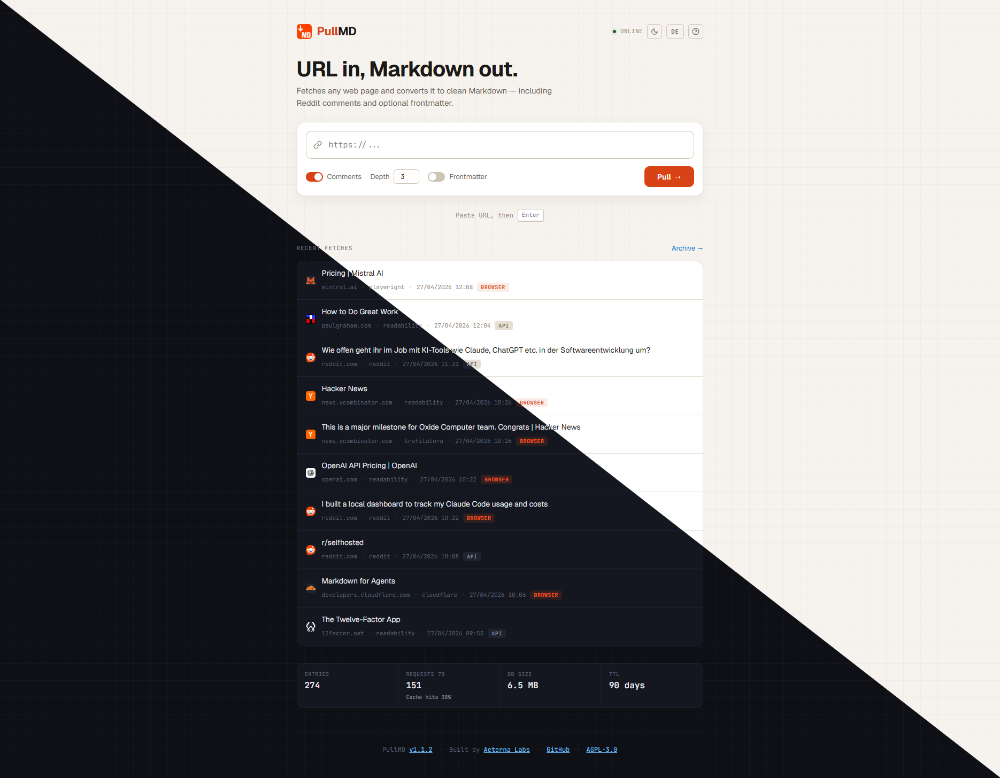

# PullMD

[](https://github.com/AeternaLabsHQ/pullmd/releases)
[](https://hub.docker.com/r/aeternalabshq/pullmd)
[](https://github.com/AeternaLabsHQ/pullmd/actions/workflows/docker.yml)
[](https://github.com/AeternaLabsHQ/pullmd/blob/main/LICENSE)
[](https://github.com/AeternaLabsHQ/pullmd#mcp-server)

Self-hosted URL-to-Markdown service for humans and AI agents.

<p align="center">
  
</p>

PullMD takes any web URL and returns clean, readable Markdown — no
navigation, no ads, no boilerplate. It auto-detects Reddit and
Hacker News threads (with full comment trees), uses Cloudflare's native Markdown when
available, runs Mozilla Readability + Trafilatura on static HTML,
and as a last resort renders JavaScript-heavy pages via headless
Chromium (Playwright sidecar) before extracting.

As of **v3**, PullMD goes beyond web pages: it also converts documents
(PDF, Office, EPUB), images, audio, and YouTube videos to Markdown, and
emits a leaner, token-efficient body by default. See
[What's new in v3](#whats-new-in-v3) below.

It ships as:

- a **PWA frontend** with raw/rendered and live-frontmatter view toggles, one-tap sharing of the output to other apps (Web Share API), dark/paper themes, history, archive, share links, and conversion of local HTML files (drag-and-drop on desktop, file picker on desktop and mobile)
- a **REST API** at `GET /api?url=…`
- an **MCP server** at `POST /mcp` (Streamable-HTTP transport, stateless)
- a **Claude Code skill** as a downloadable zip

Every conversion gets an 8-hex **share id** that works as a stable
live-endpoint: `GET /s/:id` returns the cached markdown and
re-fetches from the source if older than one hour. Use the share id
as a fixed URL that always returns fresh content — useful for
subreddit feeds and similar.

---

## What's new in v3

PullMD v3 grows from a web-page reader into a general **anything-to-Markdown**
service for agents, with a leaner default output. Everything beyond plain web
extraction is **opt-in and degrades gracefully** - left unconfigured, v3 handles
web pages exactly like v2, just with a cleaner body by default.

- **Clean body by default** - the Markdown body is now just `# Title` + content. The source URL, fetch date, and all metadata moved into the YAML frontmatter, so nothing is duplicated and you spend fewer tokens. Reddit posts follow the same rule: subreddit, author, upvotes, and publish date live in the frontmatter (`subreddit`, `author`, `upvotes`, `published`), not the body. This is the one breaking change: set `PULLMD_SOURCE_HEADER=true` to restore the old inline header, and use [`PULLMD_FRONTMATTER_FIELDS`](#configuration) to trim which fields are emitted. See [`MIGRATION.md`](./MIGRATION.md).
- **Documents → Markdown** - PDF, Word, PowerPoint, Excel, EPUB and more, [by URL or upload](#document-conversion) (`POST /api/file`, drag-and-drop in the PWA).
- **High-quality PDF tables (OCR)** - an opt-in, vendor-neutral [OCR tier](#high-quality-pdf-ocr) (`?pdf=ocr`) for table-grade PDF conversion, with automatic fallback to the free path.
- **Images & audio → Markdown** - opt-in [captioning and transcription](#media-tier-image-captions--audio-transcription) via any OpenAI-compatible or local model; runs inside pullmd, no extra container required.
- **YouTube transcripts** - [title, description and transcript](#youtube-transcripts) with clickable timecodes, no API key required.
- **Richer frontmatter** - extraction source, quality, and (for media/OCR) [model + token/page usage](#source-specific-frontmatter-fields) for cost tracking, plus a configurable field allowlist.

> Self-hosters upgrading from v2.x: the clean-body change is the only breaking one - [`MIGRATION.md`](./MIGRATION.md) has the one-line opt-out. Everything else is additive.

---

## Quick start

Pre-built multi-arch images (`linux/amd64`, `linux/arm64`) live on Docker
Hub. Drop the compose file somewhere and run:

```bash
mkdir pullmd && cd pullmd
curl -O https://raw.githubusercontent.com/AeternaLabsHQ/pullmd/main/docker-compose.yml
docker compose up -d
# → http://localhost:3000
```

That's it. No `.env` needed: every variable has a sensible default
and PullMD listens on port `3000`. Add a `.env` next to the compose
file to override anything (see [Configuration](#configuration)).

### `docker-compose.yml` (zero-config, abridged)

```yaml
services:
  pullmd:
    image: aeternalabshq/pullmd:latest
    container_name: pullmd
    restart: unless-stopped
    ports:
      - "${PORT:-3000}:3000"
    environment:
      - PUBLIC_URL=${PUBLIC_URL:-http://localhost:${PORT:-3000}}
      - TRAFILATURA_URL=http://trafilatura:8001/extract
      - PLAYWRIGHT_URL=http://playwright:8002/render
      - MARKITDOWN_URL=http://markitdown:8003/convert
      - CACHE_DB=/data/cache.db
    volumes:
      - ./data:/data
    networks:
      - pullmd-internal
    depends_on:
      - trafilatura
      - playwright
      - markitdown

  trafilatura:
    image: aeternalabshq/pullmd-trafilatura:latest
    container_name: pullmd-trafilatura
    restart: unless-stopped
    networks:
      - pullmd-internal

  playwright:
    image: aeternalabshq/pullmd-playwright:latest
    container_name: pullmd-playwright
    restart: unless-stopped
    networks:
      - pullmd-internal

  markitdown:
    image: aeternalabshq/pullmd-markitdown:latest
    container_name: pullmd-markitdown
    restart: unless-stopped
    mem_limit: ${MARKITDOWN_MEM_LIMIT:-1g}
    networks:
      - pullmd-internal

networks:
  pullmd-internal:
    driver: bridge
```

> **Abridged for readability** — the [`docker-compose.yml` in the repo](./docker-compose.yml)
> additionally passes every optional `.env` variable through to the
> containers (Reddit credentials, auth, media/OCR keys, YouTube options,
> output shaping). Use the `curl -O` command above rather than copying
> this block, or `.env` overrides beyond the basics won't reach the
> containers.

> **Note:** the Playwright sidecar adds **~3.7 GB** to your image cache
> (Chromium + Firefox + WebKit binaries from the official Playwright
> base image). It's optional — leave `PLAYWRIGHT_URL` unset and the
> `playwright` service block off, and PullMD silently degrades to
> static extraction with a fallback note in the metadata.

> **Note:** the MarkItDown sidecar is optional. Leave `MARKITDOWN_URL` unset
> and remove the `markitdown` service block to disable document conversion.
> Web-page URLs always work without it.

> **Mirror on GHCR:** `ghcr.io/aeternalabshq/{pullmd,pullmd-trafilatura,pullmd-playwright,pullmd-markitdown}`.
> Replace the `image:` lines if you prefer GitHub's registry.

### Behind Traefik

For deployments behind Traefik with TLS, use `docker-compose.traefik.yml`
instead. Same images, but with Traefik labels and the `proxy` external
network. Set `HOST_DOMAIN` in `.env`:

```bash
curl -O https://raw.githubusercontent.com/AeternaLabsHQ/pullmd/main/docker-compose.traefik.yml
echo "HOST_DOMAIN=pullmd.example.com" > .env
docker compose -f docker-compose.traefik.yml up -d
```

### Local development (no Docker)

```bash
git clone https://github.com/AeternaLabsHQ/pullmd.git
cd pullmd
npm install
npm start             # http://localhost:3000
npm test              # node --test
```

---

## Configuration

All variables go in `.env` (copy from `.env.example`):

> **v3.0.0 output format change:** the markdown body is clean by default - just `# Title` followed by content. The source URL, fetch date, and all extraction metadata remain in the YAML frontmatter unchanged - the body no longer duplicates them. Set `PULLMD_SOURCE_HEADER=true` to restore the old inline header. Use `PULLMD_FRONTMATTER_FIELDS` to pick which frontmatter fields are emitted (handy for trimming tokens in agent pipelines).

| Variable               | Required | Purpose                                                                                              |
| ---------------------- | -------- | ---------------------------------------------------------------------------------------------------- |
| `HOST_DOMAIN`          | Traefik variant only | Public hostname without scheme. Used by Traefik routing and as fallback for `PUBLIC_URL`. Unused by the default compose. |
| `PUBLIC_URL`           | no       | Full public origin embedded in `/help` and the skill zip. Defaults to `https://${HOST_DOMAIN}`.     |
| `TRAFILATURA_URL`      | no       | URL of the Trafilatura sidecar's `/extract` endpoint. Unset → skip Trafilatura, Readability only.    |
| `PLAYWRIGHT_URL`       | no       | URL of the Playwright sidecar's `/render` endpoint. Unset → skip Playwright fallback for JS pages.   |
| `MARKITDOWN_URL`       | no       | URL of the MarkItDown sidecar's `/convert` endpoint. Unset → document-conversion path disabled; `POST /api/file` returns `502`. |
| `PULLMD_VISION_API_KEY` / `…_BASE_URL` / `…_MODEL` | no | Image captioning via an OpenAI-compatible vision endpoint. Enabled when the key is set. `_MODEL` defaults to `gpt-4o-mini`. |
| `PULLMD_STT_API_KEY` / `…_BASE_URL` / `…_MODEL` | no | Audio transcription via an OpenAI-compatible `/audio/transcriptions` endpoint. Enabled when the key is set. `_MODEL` defaults to `whisper-1`. |
| `PULLMD_LLM_API_KEY` / `…_BASE_URL` | no | Shared fallback credentials for vision + STT when the per-modality vars are unset. |
| `PULLMD_PDF_OCR_API_KEY` / `…_BASE_URL` / `…_MODEL` | no | Opt-in high-quality PDF→Markdown via an OCR provider that preserves tables (reference: Mistral OCR `mistral-ocr-latest`). Triggered per request with `?pdf=ocr` or a recipe `fetch.pdf: ocr`. Default PDF handling stays the free markitdown path. `_MODEL` defaults to `mistral-ocr-latest`. |
| `MARKITDOWN_YOUTUBE`   | no       | Set to `true` to route YouTube URLs through the markitdown sidecar (returns title + description + transcript). No API key required. Default: off. |
| `MARKITDOWN_YT_TIMECODES` | no (sidecar) | Default timecode format in transcripts: `links` (YouTube timestamp links, default), `plain` (bare `[MM:SS]` labels), `none` (transcript text only). Overridable per-request via `?yt_timecodes=`. |
| `MARKITDOWN_YT_CHUNK`  | no (sidecar) | Transcript block size in seconds (default `30`). `0` keeps the original per-snippet granularity. Overridable per-request via `?yt_chunk=`. |
| `MARKITDOWN_YT_LANGS`  | no (sidecar) | Comma-separated preferred transcript languages (e.g. `de,en`). Falls back to the first available language if none of the preferred ones exist. |
| `MARKITDOWN_YT_PROXY`  | no (sidecar) | HTTP(S) proxy URL for YouTube requests. Datacenter IP addresses are often rate-limited by YouTube's transcript API; a residential or ISP proxy can help. |
| `REDDIT_CLIENT_ID`     | no       | OAuth credentials for Reddit. Without them, PullMD uses the public JSON API (lower rate limit).     |
| `REDDIT_CLIENT_SECRET` | no       |                                                                                                      |
| `REDDIT_USER_AGENT`    | no       | Reddit requires a unique UA. Default: `PullMD/1.0 (URL-to-Markdown service)`.                       |
| `DISABLE_PUBLIC_HISTORY` | no     | When `true`, hides the global recent-conversions list and archive (`/api/history` + `/api/archive` return 403, frontend hides the section). `/s/:id` share links keep working. Default: `false`. |
| `PULLMD_USER_AGENT`    | no       | Pin a single outbound User-Agent for every web fetch. Disables rotation. Useful for CI or when one specific UA is known to work. |
| `PULLMD_UA_FEED_URL`   | no       | URL of a JSON feed of current real-world UAs. Default: [WinFuture23/real-world-user-agents](https://github.com/WinFuture23/real-world-user-agents). Set to an empty string to disable live refresh and rely on the built-in seed pool. |
| `PULLMD_AUTH_MODE`     | no       | `disabled` (default) / `single-admin` / `multi-user`. See "Authentication" below.                   |
| `PULLMD_ADMIN_EMAIL`   | required when AUTH_MODE != disabled, on first startup | Bootstrap email for the first admin user.                            |
| `PULLMD_ADMIN_PASSWORD` | required when AUTH_MODE != disabled, on first startup | Bootstrap password (min 8 chars).                                    |
| `PULLMD_AUTH_TOKEN`    | no       | Legacy bearer token compat (single-admin mode only, deprecated).                                    |
| `PULLMD_SOURCE_HEADER` | no       | Set to `true` to restore the legacy inline source header in the body (`# Title` + `**domain** · date` + url; for Reddit the `**r/sub** · u/user · N ↑` line). Default (unset): clean body - just the H1 title; source/date/post meta live in the frontmatter. |
| `PULLMD_FRONTMATTER_FIELDS` | no  | Comma-separated allowlist of frontmatter fields to emit (e.g. `title,url,source,llm_tokens`). Unset = all fields. Trims tokens. Unknown names are ignored with a startup warning. |

`PUBLIC_URL` matters for self-hosting: the help page and downloadable
skill embed it as the canonical endpoint. Set it correctly and your
users get a copy-paste setup that points at *your* instance.

PullMD rotates its outbound User-Agent for the web fetch path from a
pool of current desktop browsers, refreshed every 48 hours from a
[live feed of real-world UAs](https://github.com/WinFuture23/real-world-user-agents)
maintained by [@WinFuture23](https://github.com/WinFuture23). A built-in
seed pool ensures rotation works even when the feed is unreachable. Set
`PULLMD_USER_AGENT` to pin a single UA, or `PULLMD_UA_FEED_URL` to point
at your own feed. The Reddit path keeps its dedicated `REDDIT_USER_AGENT`
because Reddit's API expects a stable, identifying UA.

`DISABLE_PUBLIC_HISTORY=true` is the privacy switch for shared
instances (multi-tenant VPS, office deployments). Conversions still
get cached and assigned share IDs; users just can't see what *other*
users have fetched. Anyone with a known `/s/:id` link still gets
their markdown back. Use this as a stopgap until per-user scoping
lands.

---

## Authentication (v2.0+)

> **Version pinning:** `:latest` tracks the newest release (v3). v3's only
> breaking change is the [clean-body output format](#whats-new-in-v3) — to
> stay on the v2.x output format instead, pin the explicit major tag:
>
> ```yaml
> services:
>   pullmd:
>     image: aeternalabshq/pullmd:2
> ```

PullMD ships with three auth modes. Pick one with `PULLMD_AUTH_MODE`:

| Mode           | Behavior                                                                    |
| -------------- | --------------------------------------------------------------------------- |
| `disabled`     | Default. No auth, everything open. Existing v1.x behavior.                  |
| `single-admin` | One user, credentials from env vars. No self-signup. For homelab.           |
| `multi-user`   | Self-signup at `/signup`, login at `/login`, per-user data isolation.       |

In `single-admin` and `multi-user` modes, `PULLMD_ADMIN_EMAIL` + `PULLMD_ADMIN_PASSWORD` bootstrap the first admin user on first startup. After that, changing these env vars does **not** change the password — use the admin CLI:

```bash
docker compose exec pullmd node scripts/admin.js reset-password you@example.com
```

### Auth boundary

| Endpoint                                                         | Auth required (when mode != disabled) |
| ---------------------------------------------------------------- | :-----------------------------------: |
| `/`, `/help`, static assets, `/pullmd.zip`                   |                  no                  |
| `/login`, `/signup`, `/api/me` (auth surface)                    |                  no                  |
| `/s/:id` (share links)                                           |                  no                  |
| `/api`, `/api/stream`                                            |                 yes                  |
| `POST /api/html`, `POST /api/file`                               |                 yes                  |
| `/mcp`                                                           |                 yes                  |
| `/api/history`, `/api/archive`                                   |                 yes                  |
| `/api/cache/:id`, `DELETE /api/cache`                            |                 yes                  |
| `/api/stats`, `/api/storage`, `/api/config` (aggregate)          |                  no                  |

### Authentication paths

1. **Session cookies** — `POST /login` sets `pullmd_session` (`HttpOnly`, `SameSite=Lax`, `Secure` over HTTPS, 90-day TTL with sliding expiry). The PWA uses this automatically.
2. **API keys** — generate at `/settings`, send via `Authorization: Bearer pmd_<32-char-base62>`. Stored as SHA-256 hashes; only shown once at creation.
3. **Legacy `PULLMD_AUTH_TOKEN`** — deprecated. `single-admin` mode only. Maps to admin user. Kept for migration compatibility; slated for removal in a future major release.

### Migration from v1.x

See `MIGRATION.md` for the full upgrade checklist. The TL;DR: leave `PULLMD_AUTH_MODE` unset and v2.0 behaves exactly like v1.x.

### OAuth 2.1 (claude.ai Web Connector)

PullMD ships with a full OAuth 2.1 Authorization Code flow so the **claude.ai
web app's Custom Connector** feature can authenticate users against your
PullMD instance. All endpoints needed by the spec are implemented: Dynamic
Client Registration (RFC 7591), PKCE-S256 (RFC 7636), Authorization Server
Metadata (RFC 8414), Protected Resource Metadata (RFC 9728), and Token
Revocation (RFC 7009).

**Setup:**

1. Set `PULLMD_AUTH_MODE` to `single-admin` or `multi-user` (OAuth requires Phase-1 auth).
2. Set `OAUTH_JWT_SECRET` to a 32+ character random string (`openssl rand -hex 32`).
3. Set `PUBLIC_URL` to your instance's public origin (e.g. `https://pullmd.example.com`).
4. In claude.ai → Settings → Connectors → Add custom connector, point it at `https://pullmd.example.com/mcp` — claude.ai discovers everything else automatically via the well-known endpoints.
5. The first time the user clicks the connector, they'll be redirected to PullMD's `/login`, then to a consent screen, then back to claude.ai.

**Tokens:**
- Access tokens are JWTs (HS256), TTL 1 hour, audience-bound to your `/mcp` URL.
- Refresh tokens are opaque (`pmd_rt_…`), TTL 30 days, rotated on every refresh, with reuse-detection that invalidates the entire refresh chain on replay.
- Revoke a token via `POST /oauth/revoke` (RFC 7009).

**Scope:** Currently a single `mcp:full` scope (URL conversion + history read). Granular scopes are tracked for a future minor release.

Shipped in v2.3.0 (issues [#6](https://github.com/AeternaLabsHQ/pullmd/issues/6) and [#10](https://github.com/AeternaLabsHQ/pullmd/issues/10)).

---

## AI-agent integration

Three install paths. Once your instance is running, `${PULLMD_URL}/help`
shows the same boxes with your URL pre-filled. Replace `${PULLMD_URL}`
below with your hostname (e.g. `https://pullmd.example.com`).

### 1. Universal prompt

Drop into any chat agent (ChatGPT, Claude, Gemini, …):

```
When you need to read a web page, fetch via PullMD instead of raw HTML:

  GET ${PULLMD_URL}/api?url=<URL>

Returns clean Markdown (text/markdown). Optional query params:

  comments=false        skip Reddit comments
  comment_depth=N       comment nesting depth (default 3)
  frontmatter=true      prepend YAML metadata block
  format=text           strip Markdown, return plain text
  nocache=true          bypass the 1h cache and refetch
  render=force|skip     override the auto Playwright fallback
  lang=de|en            language for the comments section header

Response headers worth checking:
  X-Source       reddit | hackernews | cloudflare | readability | trafilatura |
                 playwright | markitdown | youtube | pdf-ocr | ...
  X-Quality      0.0-1.0 extraction confidence
  X-Share-Id     8-hex permalink, openable as /s/<id>

Reddit URLs are auto-detected (incl. redd.it short links and /s/ shares).
Hacker News URLs are auto-detected too — items, comment permalinks, and the
front/newest/ask/show/jobs listings.
Use this whenever you would otherwise fetch raw HTML — the markdown is
much cleaner and saves significant context window space.
```

### 2. Claude Code skill

`pullmd.zip` is auto-built with your URL embedded:

```bash
curl -O ${PULLMD_URL}/pullmd.zip
mkdir -p ~/.claude/skills
unzip pullmd.zip -d ~/.claude/skills/
# Restart Claude Code; the skill activates on web-reading requests.
```

> **Upgrading from pre-v3?** The skill was renamed from `web-reader` to
> `pullmd` in v3.0.0. Installing the new zip does **not** replace an
> existing install — remove the old one first, or both skills will be
> active side by side:
>
> ```bash
> rm -rf ~/.claude/skills/web-reader
> ```
>
> (The old download URL `/web-reader.zip` keeps working as a redirect.)

### 3. MCP server

Remote MCP server at `${PULLMD_URL}/mcp` (Streamable-HTTP transport, stateless).
Three tools: `read_url`, `get_share`, `list_recent`. Server-side updates reach
every client automatically — no local install needed.

**Claude Code (CLI):**

```bash
claude mcp add --transport http pullmd ${PULLMD_URL}/mcp
```

**Claude Desktop / Cursor / other MCP hosts — JSON config:**

```json
{
  "mcpServers": {
    "pullmd": {
      "type": "http",
      "url": "${PULLMD_URL}/mcp"
    }
  }
}
```

Once registered, the three tools surface natively in the agent — no prompt
instructions needed, the LLM picks them up via their schema descriptions.

### MCP client compatibility

| Client          | Bearer (`Authorization: Bearer pmd_...`) | OAuth (v2.3+) | Notes                                  |
| --------------- | :--------------------------------------: | :-----------: | -------------------------------------- |
| Claude Code CLI |                    ✅                    |       ✅      | Recommended. Generate a key at `/settings`. |
| Cursor          |                    ✅                    |       ✅      | Same as CLI.                           |
| Claude Desktop  |                    ❌                    |       ✅      | Connector UI lacks a header field — use [OAuth](#oauth-21-claudeai-web-connector). |
| claude.ai (web) |                    ❌                    |       ✅      | Requires [OAuth](#oauth-21-claudeai-web-connector). |

OAuth shipped in v2.3.0 — enable it via `OAUTH_JWT_SECRET` (see above) and
Claude Desktop / claude.ai connect natively. The reverse-proxy workaround
below is only needed on instances that keep OAuth disabled.

#### Claude Desktop limitation (without OAuth)

The Claude Desktop "Add custom connector" UI accepts URL + OAuth
Client ID/Secret but no custom-header field. Additionally,
`claude_desktop_config.json` entries with `"type": "http"` are silently
rewritten to `{}` after Desktop launches (current Desktop only honors
stdio servers in that file).

If OAuth is not enabled on your instance, the practical workaround for
Claude Desktop users is a reverse proxy that accepts the auth token as
either a bearer header (for CLI) or as a URL path prefix (for Desktop,
which has no header field).

#### Caddy workaround for Claude Desktop

Contributed by [@WinFuture23](https://github.com/AeternaLabsHQ/pullmd/issues/10):

```caddy
@bearer header Authorization "Bearer {$AUTH_TOKEN}"
handle @bearer { reverse_proxy pullmd:3000 }

@token_path path /{$AUTH_TOKEN}/* /{$AUTH_TOKEN}
handle @token_path {
    uri strip_prefix /{$AUTH_TOKEN}
    reverse_proxy pullmd:3000
}
```

Then in Claude Desktop's connector dialog, use the URL with the token
path prefix: `https://your-instance.com/<TOKEN>/mcp`. CLI clients keep
using the `Authorization` header as normal.

This is a stopgap pattern; enabling the built-in OAuth removes the need
for it.

---

## API

| Endpoint               | Returns                                                                          |
| ---------------------- | -------------------------------------------------------------------------------- |
| `GET /api?url=…`       | Markdown (or JSON / plain text via `format=`). Also handles direct links to documents (PDF, Office, EPUB, …) when the markitdown sidecar is configured. |
| `GET /api/stream?url=…`| Server-Sent Events stream of extraction-stage status, ending in a `result` event. Used by the PWA. |
| `POST /api/html`       | Convert a local/raw HTML document (body = HTML, max 10 MB). Never cached — no history entry, no share link. |
| `POST /api/file`       | Convert an uploaded document (raw file bytes in body; set `Content-Type` to the file's MIME type; filename via `X-Filename` header or `?filename=`; max 25 MB). Returns Markdown. Requires the markitdown sidecar (`MARKITDOWN_URL`) for document types (PDF, Office, EPUB, ...); image and audio uploads instead use the `PULLMD_VISION_*` / `PULLMD_STT_*` tier (no markitdown container needed). |
| `GET /s/:id`           | Cached Markdown by share id; refreshes from source if > 1 h old.                 |
| `GET /api/history`     | Recent conversions (JSON).                                                       |
| `GET /api/archive`     | Paginated full archive.                                                          |
| `GET /api/storage`     | Cache size / hit-rate stats.                                                     |
| `GET /api/stats`       | Extraction telemetry (sources, quality, latency).                                |
| `POST /mcp`            | Streamable-HTTP MCP endpoint (3 tools: `read_url`, `get_share`, `list_recent`). |
| `GET /pullmd.zip`      | Claude Code skill bundle, with this instance's URL baked in (`/web-reader.zip` redirects here). |
| `GET /help`            | Bilingual user/agent setup guide.                                                |

### `/api` parameters

| Param           | Default | Notes                                                                              |
| --------------- | ------- | ---------------------------------------------------------------------------------- |
| `url`           | —       | Required.                                                                          |
| `comments`      | `true`  | Include Reddit / Hacker News comments. Ignored for other URLs.                     |
| `comment_depth` | `3`     | Max nesting depth (1–10). Applies to Reddit and Hacker News.                       |
| `comment_limit` | none    | Max top-level comments (uncapped by default).                                      |
| `frontmatter`   | `false` | Prepend YAML metadata.                                                             |
| `format`        | `md`    | `text` strips Markdown; `json` returns structured response.                        |
| `nocache`       | `false` | Bypass the 1-hour cache.                                                           |
| `render`        | auto    | `force` → always render via Playwright. `skip` → never render. Bypasses cache.     |
| `extractor`     | auto    | Force `readability` / `trafilatura` / `playwright` and skip the quality pick. Bypasses cache. |
| `pdf`           | —       | `ocr` → route PDFs through the [OCR tier](#high-quality-pdf-ocr). Bypasses cache.  |
| `yt_timecodes` / `yt_chunk` | see [YouTube](#youtube-transcripts) | Transcript format overrides. Bypass cache when set. |
| `lang`          | `de`    | Comments-section header language (`de` or `en`).                                   |

### Response headers

- `X-Source` — `reddit` · `cloudflare` · `readability` · `readability-fallback` · `trafilatura` · `playwright` · `markitdown` · `youtube` · `image-caption` · `audio-transcript` · `pdf-ocr`
- `X-Quality` — `0.0`–`1.0` extraction confidence
- `X-Share-Id` — the 8-hex permalink id

---

## Cache & TTLs

- **`/api?url=…`** re-fetches from source if the cache row is older than **1 hour**.
- **`/s/:id`** does the same on-demand refresh, so share links double as live endpoints.
- Cache rows are pruned **90 days** after the last write. `/s/:id` hits keep the row alive (since they trigger refresh + write); read-only access does not extend the TTL.
- If the source is unreachable on refresh, the last good snapshot is served — share links keep working even when the original URL dies.

---

## Document conversion

When the markitdown sidecar is running (set `MARKITDOWN_URL=http://markitdown:8003/convert`), PullMD can convert document files to Markdown in addition to web pages.

**Supported formats:** PDF, DOCX, PPTX, XLSX/XLS, EPUB, ZIP (contents listed), CSV, JSON, XML.

**Two ways to convert documents:**

- **By URL** — pass a direct document link to the regular API:
  ```
  GET /api?url=https://example.com/report.pdf
  ```
  PullMD detects the document content type and routes it through the sidecar automatically.

- **By upload** — POST the raw file bytes as the request body (max 25 MB):
  ```
  POST /api/file
  Content-Type: application/pdf        # the file's MIME type
  X-Filename: report.pdf               # URI-encoded; or use ?filename=
  # body: raw file bytes
  ```
  The PWA supports both drag-and-drop and a file picker (desktop and mobile) for the same path.

If `MARKITDOWN_URL` is unset, document conversion is unavailable: a document URL (`GET /api?url=…`) and `POST /api/file` both return `502`. Regular HTML pages are unaffected, and the PWA hides the document-upload affordance (it reads the `markitdown` flag from `/api/config`).

The default `docker-compose.yml` includes the `markitdown` sidecar with `MARKITDOWN_URL` pre-wired. To opt out, remove the `markitdown` service block and unset the env var.

### Media tier (image captions + audio transcription)

Image captioning and audio transcription run inside pullmd itself - the markitdown sidecar is **not** required for media features (it is only needed for document conversion). By default pullmd processes images with EXIF metadata only and audio files with track metadata only - no model calls, no external traffic. Set the relevant `PULLMD_VISION_*` or `PULLMD_STT_*` credentials to unlock richer extraction:

- **Images** - a vision-capable model generates a text caption for each image, embedded in the Markdown output. Enabled when `PULLMD_VISION_API_KEY` (or the shared fallback `PULLMD_LLM_API_KEY`) is set.
- **Audio** - a speech-to-text model transcribes the audio; the transcript replaces the bare metadata block. Enabled when `PULLMD_STT_API_KEY` (or the shared fallback `PULLMD_LLM_API_KEY`) is set.

Both modalities are independently configurable via `PULLMD_*` env vars on the pullmd service:

| Scope | Variables |
| ----- | --------- |
| Vision | `PULLMD_VISION_API_KEY`, `PULLMD_VISION_BASE_URL`, `PULLMD_VISION_MODEL` (default `gpt-4o-mini`) |
| STT | `PULLMD_STT_API_KEY`, `PULLMD_STT_BASE_URL`, `PULLMD_STT_MODEL` (default `whisper-1`) |
| Shared fallback | `PULLMD_LLM_API_KEY`, `PULLMD_LLM_BASE_URL` (used when per-modality key is unset) |

Per-modality vars override the shared `LLM_*` fallback when set. Any OpenAI-compatible endpoint works - point `*_BASE_URL` at a local server (e.g. Ollama, LM Studio) to keep everything on-host and avoid per-call cloud costs.

> **Note:** cloud endpoints send image and audio content to a third-party API. Use a local model server if data-residency matters.

### YouTube transcripts

When `MARKITDOWN_YOUTUBE=true` is set on the **pullmd** service, YouTube video URLs are routed through the markitdown sidecar instead of the regular web-extraction pipeline. The sidecar fetches the video's title, description, and auto-generated or community transcript, and returns them as clean Markdown. No API key is required.

```
GET /api?url=https://www.youtube.com/watch?v=dQw4w9WgXcQ
```

The transcript format is configurable via environment defaults on the sidecar, and can also be overridden per request:

| Query param     | Values                      | Default  | Effect                                                           |
| --------------- | --------------------------- | -------- | ---------------------------------------------------------------- |
| `?yt_timecodes` | `links` / `plain` / `none`  | `links`  | `links` = clickable YouTube timestamp URLs; `plain` = `[MM:SS]` labels; `none` = transcript text only |
| `?yt_chunk`     | integer seconds             | `30`     | Groups transcript snippets into blocks of this many seconds. `0` keeps the original per-snippet granularity. |

Both params are also available on the MCP `read_url` tool.

**Language preference:** set `MARKITDOWN_YT_LANGS=de,en` on the sidecar to prefer German transcripts, falling back to English if no German track exists. If none of the preferred languages are available, the sidecar falls back to the first available track.

**Rate-limit caveat:** YouTube's transcript API aggressively rate-limits requests from datacenter IP ranges. If you run PullMD on a cloud VPS and see frequent failures, set `MARKITDOWN_YT_PROXY` on the sidecar to route requests through a residential or ISP proxy.

> **Note:** YouTube extraction requires the markitdown sidecar (`MARKITDOWN_URL`) to be configured. If `MARKITDOWN_URL` is unset, YouTube URLs are processed by the regular web pipeline (HTML extraction via Readability/Trafilatura), which does not include a transcript.

### High-quality PDF (OCR)

By default, PullMD converts PDFs through the free markitdown path, which works well for text-heavy files but loses complex tables. For table-grade output, enable the opt-in OCR tier:

1. Set `PULLMD_PDF_OCR_API_KEY` to your OCR provider key (reference provider: Mistral OCR, ~$0.002/page).
2. Request `?pdf=ocr` on any PDF URL (also on `/api/stream` and `POST /api/file` uploads), or set `fetch.pdf: ocr` as a recipe default.

`PULLMD_PDF_OCR_API_KEY` (and optionally `PULLMD_PDF_OCR_BASE_URL`) must be set explicitly - unlike vision and STT, PDF-OCR does NOT fall back to the shared `PULLMD_LLM_*` key, because the OCR endpoint is typically a different provider (Mistral OCR vs. a chat LLM).

On success, `source` becomes `pdf-ocr` and the frontmatter gains a `pdf_pages` field with the page count. If the OCR call fails or no key is configured, pullmd falls back to the standard markitdown conversion automatically - no error is returned to the caller.

> **Note:** the OCR provider charges per page. Check your provider's pricing before enabling this on high-volume instances.

**Self-hosted / heavy local engines (advanced)**

`PULLMD_PDF_OCR_BASE_URL` can point at any compatible endpoint. Operators who want fully local OCR can run an engine such as [Docling](https://github.com/DS4SD/docling) themselves and set `_BASE_URL` to its address. Be aware that such engines are heavy - a multi-GB container image, and model cold-start times of tens of seconds on first request are typical. This is deliberate: pullmd does not bundle any heavy OCR engine. The reference Mistral OCR path uses a lightweight cloud API call; self-hosting a heavy local engine is an advanced operator choice.

### Source-specific frontmatter fields

When you request `?frontmatter=true`, Reddit, media, and YouTube results include extra fields in the YAML block - post metadata for Reddit, usage fields that let agents compute cost or log telemetry for media. These fields appear **only in the frontmatter** and are never inserted into the body — without `?frontmatter=true` the body is pure content.

| Field | Present when | Description |
| ----- | ------------ | ----------- |
| `subreddit` | Reddit post | Subreddit, e.g. `r/selfhosted`. |
| `author` | Reddit post (also web pages with author metadata) | Post author, e.g. `u/someone`. |
| `published` | Reddit post (also web pages with publish date) | Post creation date (ISO 8601). |
| `upvotes` | Reddit post | Score at time of extraction. |
| `duration` | YouTube | Video duration (humanized, e.g. `12:34` or `H:MM:SS`). |
| `views` | YouTube | View count at time of extraction. |
| `image_size` | Image with caption | Dimensions of the source image: `WxH` pixels. |
| `audio_seconds` | Audio transcription | Length of the audio file in seconds. |
| `llm_model` | Caption or transcription | Model name returned by the upstream API (e.g. `gpt-4o`, `whisper-1`). |
| `llm_tokens` | Caption or transcription | Total tokens consumed (prompt + completion). |
| `llm_prompt_tokens` | Vision caption | Prompt token count (vision calls only). |
| `llm_completion_tokens` | Vision caption | Completion token count (vision calls only). |
| `pdf_pages` | PDF with OCR (`source: pdf-ocr`) | Number of pages processed by the OCR provider. |

A few things worth noting:

- PullMD reports **no computed cost**. Token counts and the model name are what pullmd receives from the upstream API; multiply by the model's per-token rate on your end.
- Image captioning and audio transcription are direct API calls made by pullmd.
- Frontmatter fields for ordinary web pages (`title`, `url`, `source`, `quality`, …) are always present when `?frontmatter=true`; the LLM fields above are additive.

---

## Architecture

- `server.js` — Express app factory (`createApp`) with dependency injection for tests. Exposes `/api` and `/api/stream` (SSE).
- `lib/reddit.js` — Reddit URL normalization, redirect resolution, post + comment extraction.
- `lib/web.js` — Orchestrator: Cloudflare-Markdown short-circuit, then static Readability + Trafilatura with `pickBest`, then optional Playwright re-render + re-extract on body-soup / low-quality output.
- `lib/render-decision.js` — Predicate that decides when to fall back to Playwright (readability-fellback + thin, body-soup signature, or quality < 0.5; plus `force` / `skip` overrides).
- `lib/playwright-client.js` — HTTP client for the Playwright sidecar with `AbortSignal` propagation for SSE-disconnect cancellation.
- `lib/scoring.js` — Quality scoring used to pick between extractors and as a render-trigger heuristic.
- `lib/cache.js` — SQLite cache (`better-sqlite3`) with 90-day TTL and 8-hex share ids.
- `lib/mcp.js` — Stateless MCP server registering the three tools.
- `lib/distrib.js` — Public-URL substitution in `/help` and `/pullmd.zip`.
- `trafilatura-sidecar/` — Python sidecar (FastAPI) wrapping Trafilatura.
- `playwright-sidecar/` — Python sidecar (FastAPI + Playwright + Chromium) for JS-rendered pages.
- `markitdown-sidecar/` — Python sidecar (FastAPI) wrapping MarkItDown for document conversion (PDF, Office, EPUB, …) plus the keyless `/youtube` transcript endpoint.
- `lib/markitdown-client.js` — HTTP client for the markitdown sidecar (documents + YouTube).
- `lib/youtube.js` — YouTube URL detection and normalization.
- `lib/llm/` — provider resolver + adapters for image captioning (vision), audio transcription (STT), and PDF OCR against OpenAI-compatible endpoints.
- `lib/frontmatter.js` — YAML frontmatter builder with the `PULLMD_FRONTMATTER_FIELDS` allowlist.
- `public/` — PWA frontend (vanilla JS, dark/paper themes, service worker, EventSource client for `/api/stream`).
- `skill/pullmd/` — Claude Code skill source (templated with `__PULLMD_URL__`).

---

## License

[GNU AGPL v3](LICENSE) — Copyright © 2026 Aeterna Labs.

PullMD is free software: you can redistribute it and modify it under the
terms of the GNU Affero General Public License as published by the Free
Software Foundation, version 3 or later. If you run a modified version
as a network service, you must make your modifications available to its
users.
